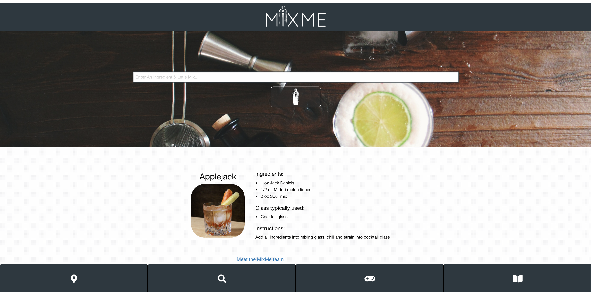
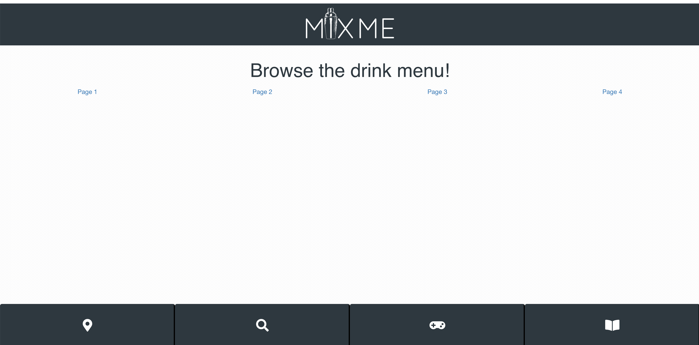
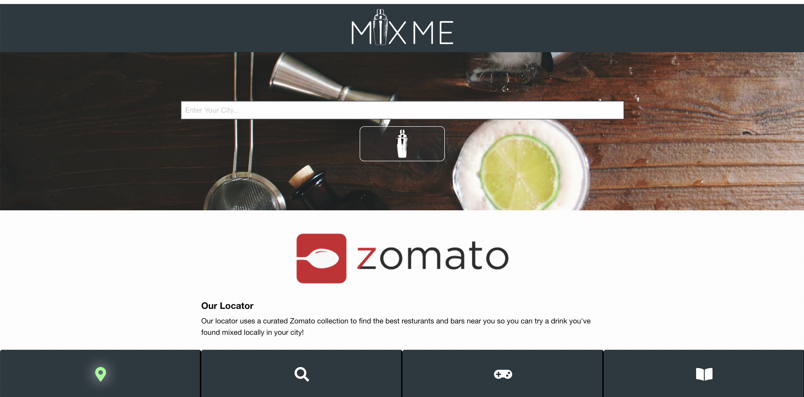
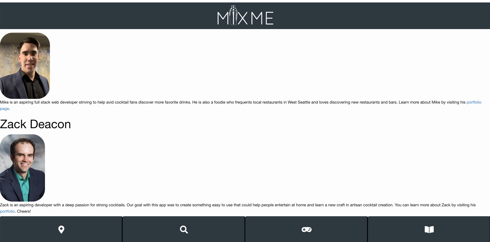

Deployed Link: https://vinavarghese.github.io/ProjectMixMe/

# ProjectMixMe Description

Salmon Manateam Six is proud to present our newest app, MixMe! MixMe is an interactive platform that allows users to browse their favorite cocktails, search cocktail recipes by ingredient, play an interactive game to learn about their favorite cocktails, and find bars in their local area that serve the cocktails. Input your favorite ingredients and discover your new favorite cocktails to make. Then, order one at a local establishment and compare your concoction to theirs! 

Users are greeted on the home page with a picture of an enticing lime cocktail and the ingredients of a randomly suggested drink. MixMe searches the CocktailDB API to return a list of drinks with the searched ingredient. The drink list will also include other ingredients and the full steps to make the drink. The footer bar buttons (from left to right) perform the following tasks: 1) navigates to a page using the Zomato API to search local restaurants, 2) returns to the homepage, 3) navigates to the interactive game, with various difficulty levels, and 4) navigates to the cocktail menu library. Each page also features a link to the homepage, clicking the MixMe logo in the header, and for the team bio page, "Meet the Team", at the bottom of the homepage's scrollable area. 

Stylistically, the four icons in the navigation buttons along the bottom of the page are formatted to look etched into the screen and they light up with a green glow when the cursor hovers over them. 

# Project MixMe - Screenshots

1. Home Page

2. Drink Menu

3. Restaurant locator

4. Interactive Game

5. Team Bio

